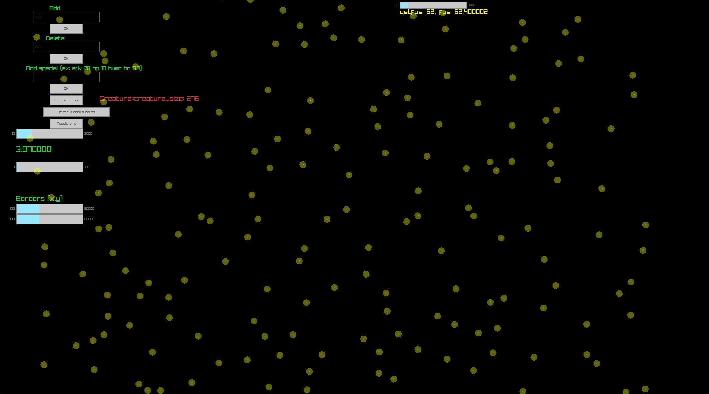

# Creature Simulator

A 2D creature combat simulator built with C++ and raylib. Spawn creatures with custom stats, watch them roam randomly, and engage each other when they cross paths.



---

## Features

- Spawn multiple creatures that move in random directions
- Customize each creature's stats (HP, ATK, hit chance, sight radius, and more)
- Creatures automatically chase when an enemy enters their sight radius and attack when they entered their range radius
- Human-controlled mode to control a creature with WASD
- Adjustable simulation speed

---

## Requirements

- Windows 11
- C++ compiler — [MinGW-w64 GCC](https://www.mingw-w64.org/) recommended
- [raylib](https://www.raylib.com/)
- [raylib-cpp](https://github.com/RobLoach/raylib-cpp)
- (optional)[VSCode](https://code.visualstudio.com/) with the C/C++ extension

---

## Setup

### 1. Clone the repository

```bash
git clone https://github.com/asm-enjoyer/creature-sim.git
cd creature-simulator
```

### 2. Add your compiler to PATH

Make sure your C++ compiler (e.g. `g++`) is accessible from the terminal. You can verify with:

```bash
g++ --version
```

### 3. Configure include paths

Most of them come ready but some need to be changed personally.

#### For VSCode
In **`tasks.json`** change the raylib-cpp include path according to your system:

```json
"args": [
   ...other args
  "-I",
  "path/to/raylib-cpp/include",
  ...other args
]
```

Same for **`c_cpp_properties.json`**:

```json
"includePath": [
  "${workspaceFolder}/**",
  "path/to/raylib-cpp/include"
]
```

#### For terminal
Running the program
```bash
g++ -g main.cpp -o main.exe -I include -I path/to/raylib-cpp/include -L lib -lraylib -lgdi32 -lwinmm
```

Debugging the program
```bash
g++ -g main.cpp -o main.exe -I include -I path/to/raylib-cpp/include -L lib -lraylib -lgdi32 -lwinmm && gdb main.exe
```
Warning: Raylib logs are printed on top of gdb ui and won't work together. Also SetTraceLogLevel for setting no logs doesn't work with raylib::Window so it's hard to debug only with gdb. InitWindow should work though.

---

## Running the Project

1. Open the project folder in VSCode
2. Go to the **Run and Debug** panel (`Ctrl+Shift+D`)
3. Select **Run** or **Debug** from the dropdown
4. Press **F5** to launch

---

## Spawning Creatures with Custom Stats

When spawning a creature, you can pass a string of commands to configure its stats. Commands can be combined in any order.

| Command | Alias | Description | Value |
|---|---|---|---|
| `atk <a>` | - | Attack damage | Any float |
| `hp <a>` | - | Max health | Any float |
| `hit_chance <b>` | `hc <b>` | Probability of a hit landing | Float in `[0, 1]` |
| `sight_r <a>` | `sr <a>` | Radius of the sight circle | Float > 0 |
| `range_r <a>` | `rr <a>` | Radius of the attack range circle | Float > 0 |
| `pos <x> <y>` | - | Starting position in the world | Floats > 0 |
| `human_controlled` | `humc` | Makes this creature player-controlled (WASD) | - |

**Example:**
Adds a creature that has 150 hp, can be controlled by keys, has 25 attack damage, has a hit chance of 80%, 120 units of sight radius, 40 units of range radius and a position of x = 300, y = 200.
```
hp 150 humc atk 25 hc 0.8 sr 120 rr 40 pos 300 200
```
---

## License

This project is licensed under the **MIT License**, see [LICENSE.txt](LICENSE.txt) for details.